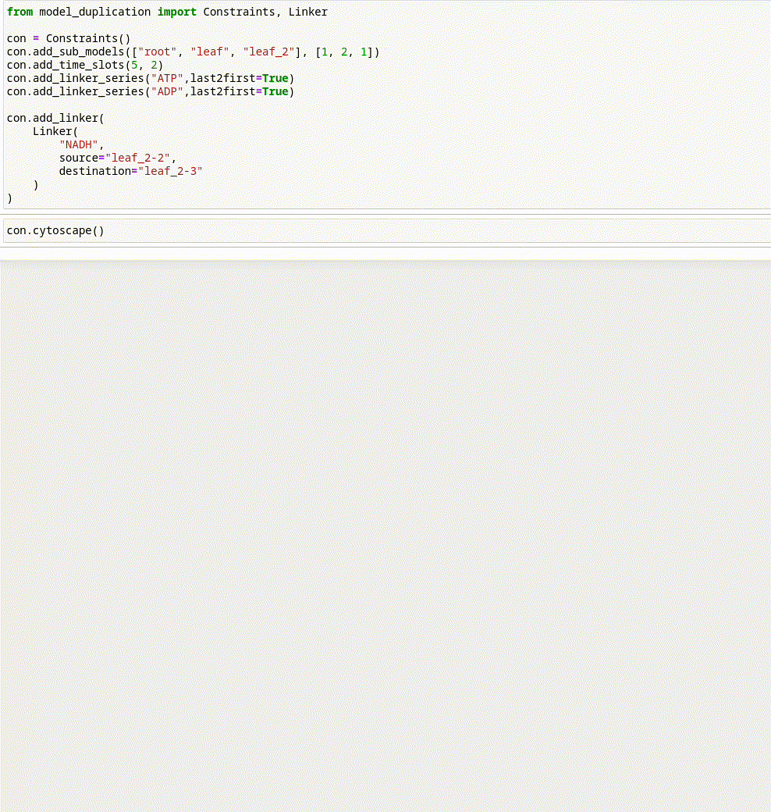

Cobra2D is a Python package that extends COBRApy to automatically reconstruct time-resolved and/or multi-subsystem metabolic models. It generates context-specific submodels, adds linker and/or transfer reactions to connect them, and scales reactions to account for the lengths of the respective time intervals and the sizes of the subsystems. Cobra2D also provides a time interval- and subsystem size-aware weighted pFBA function.

### General process:

* Define time intervals (phases) and subsystems (e.g. cell types, tissues or organs)
* Contextualizing sub-models
  * Adjusting compartment sizes
  * Adjusting time intervals
  * Defining linker reactions (auxiliary reactions that connect phases and allow storage metabolites to be transferred across consecutive phases)
  * Defining transfer reactions (auxiliary reactions that connect subsystems and allow exchange metabolites to be transferred across subsystems)
  * Adding context-specific constraints to submodels
* Construction of a new model containing all context-specific submodels and  their respective constraints

For this process, this package provides functionalities to not only simplify this process, but also to easily save and
share the defined settings with other people.

### Use cases for this package

There are two ways to use this package: functions implemented in Python can be used to define phases and constraints directly, or an XML file can be created and read in to generate a new model.

### Examples

Examples of package usage can be found in the examples folder, including scripts that demonstrate the core functions and a sample XML file showing how parameters are stored. 

### Visualization

The package also provides the possibility to obtain an overview of the created settings via an animated or static graphic.

<object data="../../assets/media/ConInteractive.gif" type="image/gif">
      <object data="https://github.com/Toepfer-Lab/model_duplication/blob/c42dfdac52524a93323e78e1f3d996aef5e01714/assets/media/ConInteractive.gif" type="image/gif">
        
      </object>
</object>

### Installation

After cloning the repository, the package can be installed in the current Python environment using pip. In a terminal, this can be done with the following commands: 

```
git clone https://github.com/Toepfer-Lab/model_duplication

cd model_duplication

pip install .
```
