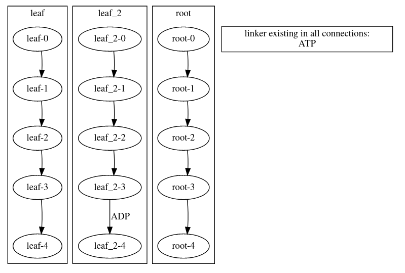
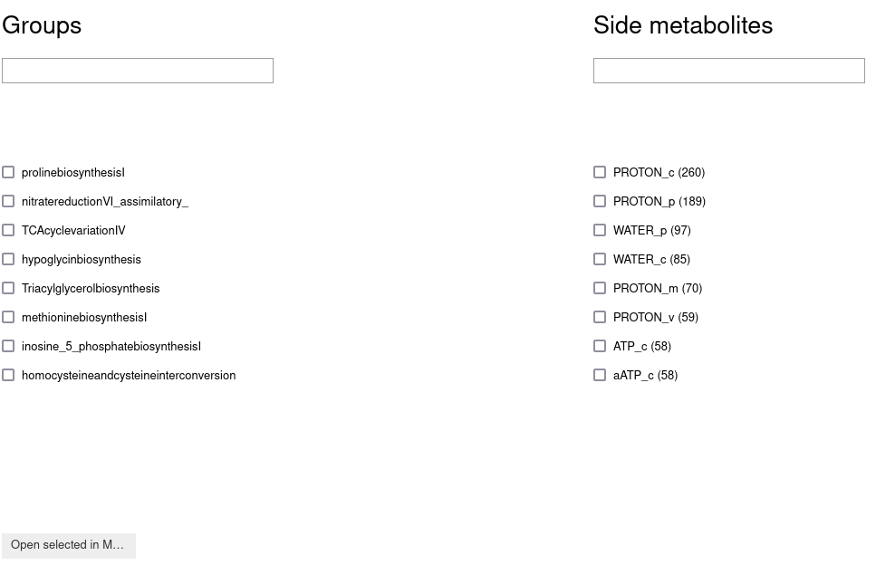

Visualization options
=============================================

There are three different possibilities for visualization. Two of them are limited to the visualization of the
structure based on the phases using GraphViz and Cytoscape.
The third visualization option provides an insight into COBRApy models. This is done using MetExploreViz.

The following Code block is the basis for the visualizations on this page.

.. doctest:: Viz

    >>> from cobra2d import Constraints, Linker
    >>> con = Constraints()
    >>> con.add_sub_models(["root", "leaf", "leaf_2"], [1, 2, 1])
    >>> con.add_time_slots(5, 2)
    >>> con.add_linker_series("ATP",last2first=False)
    >>> con.add_linker( Linker( "ADP", source="leaf_2_3", destination="leaf_2_4" ) )

GraphViz
----------
Visualization using GraphViz creates a static image that can later be used in other contexts.

.. note::
    Rendering the graph requires the Graphviz system package. It is separate from the
    ``graphviz`` Python package and cannot be installed via pip, please refer to the
    `documentation of graphviz <https://graphviz.readthedocs.io/en/stable/manual.html>`_.
    If it is missing, :py:meth:`~cobra2d.constraints.constraints.Constraints.create_graph`
    issues a :py:class:`~cobra2d.error.GraphvizNotInstalled` warning.

The visualization can be created with the following command.

.. doctest:: Viz

    >>> con.create_graph()

    Example of visualization with GraphViz where ATP is transported to the following time period respectively.

Cytoscape visualizes the same as GraphViz but in an interactive environment. Thus, much more information is available
than is available when using Graphviz. However, this information is not all displayed at the same time,

Hence the different uses of GraphViz and Cytoscape visualization.
GraphViz is therefore the better choice for visualizations that are to be used outside the
Jupyter Notebook and Cytoscape is the visualization that is suitable if the visualization is only
used inside the Jupyter Notebook.

Cytoscape
----------
As already described, GraphViz and Cytoscape visualize the phases. The visualization via Cytoscape, unlike GraphViz, is interactive. While the interactive interface provides more detail, it requires the user to select the phase of interest to display the additional information, which reduces its usability as a static representation.

Below is a brief example of this visualization.

.. doctest:: Viz

    >>> con.cytoscape()

.. figure:: ../../assets/media/ConInteractive.gif
   :scale: 50 %
   :alt: Example of visualization using Cytoscape
    Example of visualization with Cytoscape where ATP is transported to the following time period respectively.

Metexplore
------------

We also provide the possibility to visualize a COBRApy model using Metexplore.
Due to performance constraints, we provide an interface that allows the selection of groups and the
hiding metabolites of the COBRApy model. These are then visualized using MetExploreViz.

The pathways are sorted alphabetically and the metabolites are sorted based on their occurrence.

.. doctest:: Viz

    >>> from cobra2d.visualization.helper import metexplore_interface
    >>> metexplore_interface(model)

    Example of the interface used to select groups and hide metabolites before visualizing a COBRApy model with MetExploreViz.